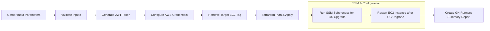

```mermaid
flowchart LR
    subgraph Initialization
    A[Gather Input Parameters] --> B[Validate Inputs]
    end

    subgraph GitHub Tokens Generation [GitHub Tokens Generation]
        C[Generate JWT Token]
        D[Generate Runner Installation Token]
    end

    subgraph Terraform Phase
        E[Terraform Init & Validate]
        F[Terraform Plan]
        G[Terraform Apply]
    end

    subgraph SSM & Configuration
        H[Run SSM Subprocess for OS/Software Config]
        I[Install & Configure GH Runner]
        J[Optional CrowdStrike Installation]
        K[Set Action-Runner Pre-Run Job for extraheader_off.sh]
    end

    B --> C --> D --> E --> F --> G --> H --> I --> J --> K --> L[Retreive Runners and their Status]

    L --> M[Push Summary State File]
```

---

## Self-hosted GitHub Runners Management

## **Objective**
Automate the lifecycle management of self-hosted GitHub Actions runners in AWS EC2 instances. This includes:
- GitHub Runners Management workflow
    - Provisioning/destroying of EC2 instances and downstream resources for self-hosted runners.
    - Automated creation, registration, and de-registration of runners in GitHub.  
    - Installation of CrowdStrike Falcon Sensor on the runners' EC2 instances (optional).      
- GitHub Runners EC2s Update workflow    
    - Automated OS upgrades for the runners (based on the OS-Release tag).

---

## **Technologies Used** (driven by approved-for-use tools)
- **GitHub Actions**: For CI/CD workflows.
- **Terraform**: For infrastructure-as-code (IaC) provisioning.
- **AWS EC2**: For hosting self-hosted runners.
- **AWS SSM (Systems Manager)**: For runner setup and maintenance.
- **CrowdStrike Falcon Sensor**: For security compliance (optional).
- **GitHub REST API**: For GitHub Runners' registration, scanning, de-registration.
- **Bash/Python Scripts**: For automation tasks.

---

## **Key Features**
1. **Automated Runner Lifecycle**: Automated creation, registration, and de-registration of self-hosted GitHub runners using Terraform and GitHub REST APIs.
2. **Seamless Runner Updates**: 
- Terraforming AWS SSM "under the hood" for seamless OS upgrades, runner setup and registration, pre-run hook configuration
- GitHub Runners De-registration with local-exec provisioner when EC2s are destroyed.
- Optional CrowdStrike Falcon Sensor installation and registration for enhanced security
3. **Reporting & Visibility**: Summaries of workflow steps in GitHub Actions, plus a final summary state file.

---

## Workflows Overview
### GitHub Runners Management Workflow
This manual workflow manages runner creation, registration, and de-registration based on input parameters. 
#### Flow Diagram

#### Steps
1. **Gather Input Parameters**: Allows the user to specify instance type, runner type and labels, number of runners etc.
2. **GitHub Registration**: Obtains necessary tokens from GitHub for runner registration.
3. **Terraform Plan & Apply**:
- Provisions or destroys the EC2 infrastructure.
- Injects runner-specific data (tokens, environment variables).
- Triggers SSM resources to process scripts for
    - OS/Software updates
    - GH Runner setup and registration
    - CrowdStrike Falcon Sensor installation (optional)
    - Action-Runner Pre-Run Job for extraheader_off.sh
4. **Check Runner Status**: Scans the github runners at GitHub, returns the details.
5. **Push Summary State File**:
Logs essential details (e.g., created instance IDs, runner registration output) into GitHub Actions summary.
---

### GitHub Runners OS/Software Update Workflow
- Automated OS upgrades for existing EC2-based runners. 
- Requires setting the "OS-Release" tag on appropriate EC2 instances.
---

#### Flow Diagram

#### Steps
1. **Gather Input Parameters**: Allows the user to specify instance type, runner type and labels, number of runners etc. and 
2. **Retrieve Target EC2 Tag**: Starts iteration over EC2s with the "OS-Release" tag. 
3. **Terraform Plan & Apply**:
    - Uses the same runner installation token logic if re-registration is needed (e.g., after a destroy/create event).
    - Runs OS-level updates and reboots through AWS SSM documents.
4. **Retrieve Runners Information**: Get the list of GH Runners after OS upgrade.
### Responsibilities
As the DevOps engineer on this project, I had E2E responsibility for the project. Including: 
1. Discovery and Design of the overall solution
2. Development and Testing
3. Documentation
4. "Golden Images" creation and maintenance (manual process)
5. Training and Hands-Over

---

### Lessons Learned
**"Each thing should do one thing that it is designed to do."** 
- Terraform is not suited for OS/Software configuration
- Mixing of Infra and Software Configuration in one "flacon" does not work well.

**"Best is the enemy of good"**
- Don't try automating everything in full, bring the MVP first
- Rely on target audience's knowledge. They know best what to configure and how to use

**"Acknowledge existing limitations"**
- GitHub Actions use hardcode elements - options lists, release/tags in workflow dispatch etc. Don't ask "why"

---

### What I Would Do Differently or Improve ��
1. **Revise solution approach in favor of Autoscaling**: Introduce dynamic scaling solution (e.g., [GitHub Actions Runtime Controller](https://github.com/actions/actions-runtime-controller)) to add/remove runners based on queue length or job demands. 

2. **Decouple Infra & Config**: Separate Terraform responsibilities (EC2 creation) from OS/software configuration—potentially using Ansible for the latter.
3. **Golden Image Flow**: Use a tool like Packer to build consistent images with pre-installed dependencies, ensuring new instances meet standardized requirements.
4. **Automatic Cross-Tracking Mechanism**: Verify each newly launched or rebuilt runner is derived from the intended golden image and retains the designated software stack.
